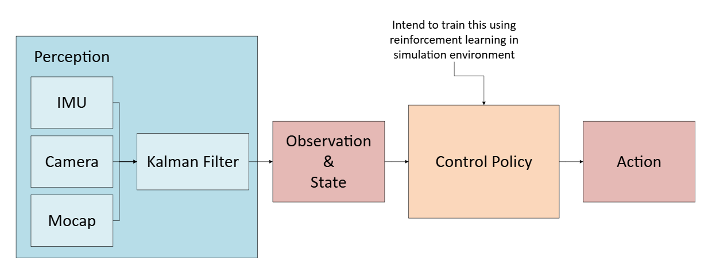
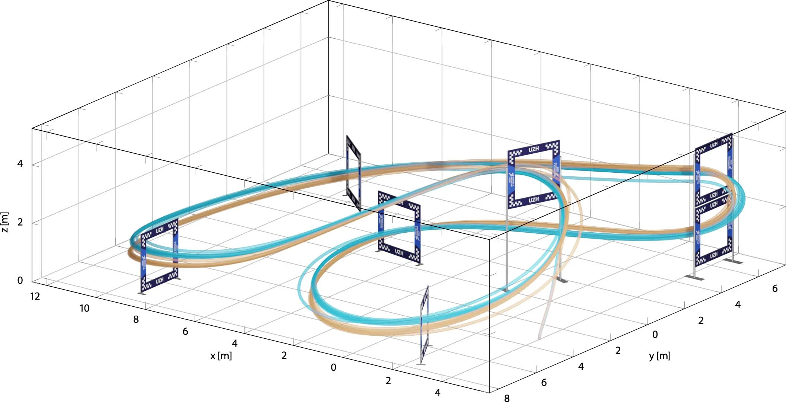

::: {.hero-section}


# Crazyflie Quadrotors in Complex Envrionments {.title}

::: {.subtitle}
Developing a learning-based ROS2 controller inspired by the Swift system 
for time-optimal trajectory tracking and agile obstacle avoidance.
:::

::: {.author-list}

[**Xiyuan Zhou**](https://github.com/Annaz2024-ECE)^1^,
[**Wenjuan Lin**](https://github.com/LatentLin2512)^1^,
[**Susheendhar Vijay**](https://github.com/psushi)^1^

:::

::: {.affiliation-list}

^1^University of Illinois Urbana-Champaign (UIUC)

:::

::: {.button-row}

[[ Video]{.btn-text}](https://youtu.be/2sHEZuPWeng?si=UWs1HXVacxRZi8IE){.btn .btn-primary}
[[ Code]{.btn-text}](https://github.com/safeautonomy-illinois-students/project-site-wayno2-0.git){.btn .btn-primary}

:::

:::


<!-- ============================================================ -->
<!-- TEASER IMAGE / VIDEO -->
<!-- ============================================================ -->

::: {.section-container}

::: {.hero-teaser}

<!-- Option A: Use a static image as the teaser -->
{.teaser-img}

<!-- Option B: Embed a video teaser (uncomment below, comment out image above)

-->

:::

:::


<!-- ============================================================ -->
<!-- ABSTRACT -->
<!-- ============================================================ -->

::: {.section-container}

## Abstract {.section-title}

::: {.abstract-text}
Autonomous drone racing requires a robot to fly at its physical limits 
while navigating complex 3D circuits using onboard sensors. Inspired by 
the recent Swift system which achieved world-champion level performance, 
this project aims to develop a high-performance autonomous navigation 
pipeline for the Crazyflie quadrotor.

Our current work establishes a robust Gazebo-based simulation environment 
(CrazySim) to serve as the training ground for our control policies. 
We propose to adopt a model-free deep reinforcement learning (RL) approach, 
similar to the methodology used by Kaufmann et al.(2023), to train a neural 
network control policy in simulation. To overcome the Sim-to-Real gap, 
we intend to implement residual modeling techniques that account for 
unmodeled aerodynamics and sensor noise, ensuring a smooth transition 
from simulation to the physical flight arena.

By integrating the crazyswarm2 autonomy stack with learning-based controllers, 
we aim to achieve precise gate traversal and time-optimal trajectories that 
push the boundaries of classical control.
:::

:::


<!-- ============================================================ -->
<!-- OVERVIEW / METHOD VIDEO -->
<!-- ============================================================ -->

::: {.section-container}

## Video {.section-title}

::: {.video-container}
<!-- Replace with your YouTube or local video embed -->

:::

:::


<!-- ============================================================ -->
<!-- RESULTS GALLERY -->
<!-- ============================================================ -->

::: {.section-container}

## Results {.section-title}

::: {.content-text}
Target Vision: Time-optimal trajectories for autonomous drone racing through 
a multi-gate circuit, inspired by the Swift system.
Image source: Kaufmann et al. (2023).
:::

::: {.results-grid}

::: {.result-card}

:::

:::

:::


<!-- ============================================================ -->
<!-- QUALITATIVE COMPARISONS -->
<!-- ============================================================ -->

::: {.section-container}

## Qualitative Comparisons {.section-title}

::: {.content-text}
Describe the comparison setup — which baselines are you comparing against, and
what should the reader look for in the side-by-side results.
:::

::: {.comparison-grid}

::: {.comparison-item}


**Ours**
:::

::: {.comparison-item}


**Baseline A**
:::

:::

:::


<!-- ============================================================ -->
<!-- INTERACTIVE SLIDER (Optional) -->
<!-- ============================================================ -->

::: {.section-container}

## Interpolation Demo {.section-title}

::: {.content-text}
If your method supports interpolation or continuous control, you can add an
interactive slider here. The example below shows how to set one up.
:::

::: {.interpolation-panel}

::: {.interpolation-endpoints}
{.endpoint-img}

{.endpoint-img}
:::

<input type="range" min="0" max="100" value="50" class="interpolation-slider" id="interpolation-slider">
<div id="interpolation-value" class="interpolation-value">50%</div>

<script>
  const slider = document.getElementById('interpolation-slider');
  const display = document.getElementById('interpolation-value');
  slider.addEventListener('input', function() {
    display.textContent = this.value + '%';
  });
</script>

:::

:::


<!-- ============================================================ -->
<!-- RELATED WORK -->
<!-- ============================================================ -->

::: {.section-container}

## Related Work {.section-title}

::: {.content-text}

Here are some related works in this area:

- [Champion-level drone racing using deep reinforcement learning](https://www.nature.com/articles/s41586-023-06419-4) 
also addresses the gap between simulation and physical reality (Sim-to-Real) using data-driven residual models to account for unmodeled aerodynamics and sensor noise.
- [D4RT: Teaching AI to see the world in four dimensions](https://deepmind.google/blog/d4rt-teaching-ai-to-see-the-world-in-four-dimensions/) 
introduces a unified 4D reconstruction and tracking framework. 
While our project focuses on ROS2-based control, 
D4RT represents the cutting edge of spatial perception, 
which is essential for high-speed autonomous navigation and "world model" understanding.

:::

## References {.section-title}

::: {.content-text}

[1] Kaufmann, E., Bauersfeld, L., Loquercio, A., et al. "Champion-level drone racing using deep reinforcement learning." 
*Nature* 620, 982–987 (2023). [https://doi.org/10.1038/s41586-023-06419-4](https://doi.org/10.1038/s41586-023-06419-4)

:::

:::


<!-- ============================================================ -->
<!-- BIBTEX -->
<!-- ============================================================ -->

::: {.section-container}

## BibTeX {.section-title}

```bibtex
@article{WayNo2.0-2026project,
  author    = {Zhou Xiyuan and Lin Wenjuan and Vijay Susheendhar},
  title     = {Crazyfile Quadrotors in Complex Environment},
  howpublished = {Project Report for ECE 484: Principles of Safe Autonomy, University of Illinois Urbana-Champaign},
  year      = {2026},
  note      = {Course Project}
}
```

:::


<!-- ============================================================ -->
<!-- FOOTER -->
<!-- ============================================================ -->

::: {.site-footer}

This website template is adapted from the
[Nerfies](https://nerfies.github.io) project page, which is licensed under a
[Creative Commons Attribution-ShareAlike 4.0 International License](http://creativecommons.org/licenses/by-sa/4.0/).

:::
