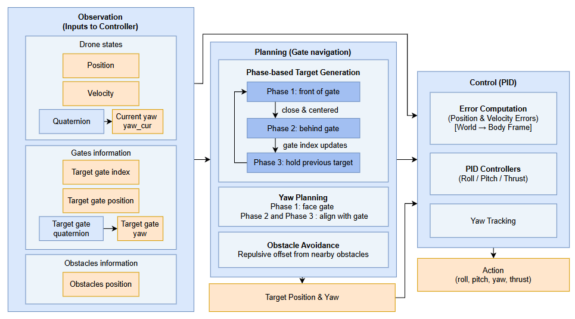
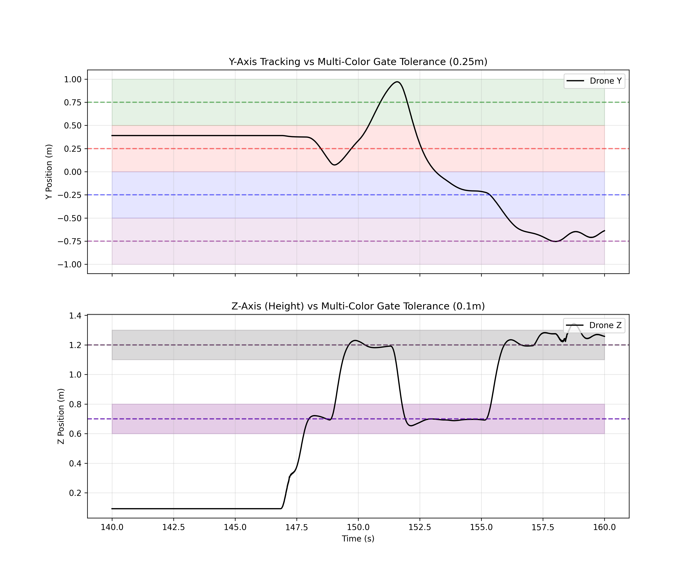
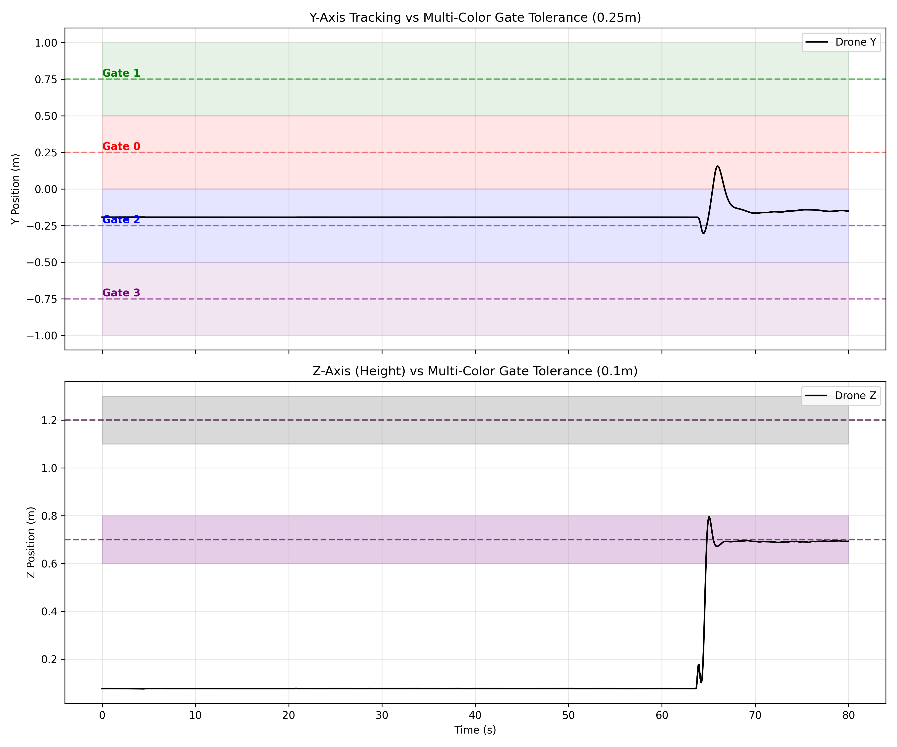

::: {.hero-section}


# Wayno Crazyflie Quadrotor {.title}

::: {.subtitle}
Developing a learning-based ROS2 controller inspired by the Swift system 
for time-optimal trajectory tracking and agile obstacle avoidance.
:::

::: {.author-list}

[**Xiyuan Zhou**](https://github.com/Annaz2024-ECE)^1^,
[**Wenjuan Lin**](https://github.com/LatentLin2512)^1^,
[**Susheendhar Vijay**](https://github.com/psushi)^1^

:::

::: {.affiliation-list}

^1^University of Illinois Urbana-Champaign (UIUC)

:::

::: {.button-row}

[[ Simulation Video]{.btn-text}](https://youtu.be/hbPQByq5deU){.btn .btn-primary}
[[ Hardware Video]{.btn-text}](https://youtu.be/iOUJcZcdEEY){.btn .btn-primary}
[[ Code]{.btn-text}](https://github.com/safeautonomy-illinois-students/drone-track-wayno2.git){.btn .btn-primary}

:::

:::


<!-- ============================================================ -->
<!-- TEASER IMAGE / VIDEO -->
<!-- ============================================================ -->

::: {.section-container}

::: {.hero-teaser}

<!-- Option A: Use a static image as the teaser -->
{.teaser-img}

<!-- Option B: Embed a video teaser (uncomment below, comment out image above)

-->

:::

:::


<!-- ============================================================ -->
<!-- ABSTRACT -->
<!-- ============================================================ -->

::: {.section-container}

## Abstract {.section-title}

::: {.abstract-text}
Autonomous drone racing requires a robot to navigate complex 3D circuits with agility and precision using onboard sensors. 
This project aims to develop a high-performance autonomous navigation pipeline for the Crazyflie quadrotor, 
ultimately delivering a highly stable and fast autonomous flight system.

Our current work establishes a robust Gazebo-based simulation environment (CrazySim) 
to serve as our primary testing and training ground. 
To achieve our goal of high-speed stability, we are pursuing a dual-track approach: 
advancing a classical pipeline (global trajectory planning paired with optimal control) 
while simultaneously exploring a model-free deep reinforcement learning (RL) policy. 
To overcome the Sim-to-Real gap, 
we intend to implement techniques that account for unmodeled aerodynamics and sensor noise, 
ensuring a smooth transition from simulation to the physical Highbay arena.

By integrating the crazyswarm2 autonomy stack with these advanced control strategies, 
we aim to achieve reliable gate traversal, robust obstacle avoidance, and consistently fast lap times.
:::

:::


<!-- ============================================================ -->
<!-- Simulation (software) -->
<!-- ============================================================ -->

::: {.section-container}

## Software: Simulation Progress {.section-title}

::: {.content-text}
We have established a robust Gazebo-based simulation environment. 
A baseline PID controller has been fully implemented and tested in simulation, 
demonstrating reliable gate traversal and waypoint tracking under ideal physics conditions.
:::

::: {.video-container}
<!-- Replace with your YouTube or local video embed -->

:::

:::


<!-- ============================================================ -->
<!-- Flight (hardware) -->
<!-- ============================================================ -->

::: {.section-container}

## Hardware: Physical Flight Tests {.section-title}

::: {.content-text}
Moving from simulation to the physical Highbay environment, 
we have successfully collected Rosbag data and tested our controller on the Crazyflie hardware. 
Currently, stable hover is achieved, and by scaling down the target velocity, 
the drone can successfully complete a full lap of the circuit.
:::

::: {.video-container}
<!-- Replace with your YouTube or local video embed -->

:::

:::


<!-- ============================================================ -->
<!-- Data Analysis -->
<!-- ============================================================ -->

::: {.section-container}

## Data Analysis & Metrics {.section-title}

::: {.content-text}
We utilize `mcap` Rosbags collected during our physical hardware runs to evaluate controller robustness. 
We track the positional error against our gate passing thresholds: **±0.25m in the Y-axis (lateral)** 
and **±0.1m in the Z-axis (vertical)**.
:::

::: {.comparison-grid}

::: {.comparison-item}
### Successful Traversal

<p style="font-size: 16px !important; line-height: 1.6 !important; font-weight: normal !important; text-align: left !important; margin-top: 15px;">
<strong>Analysis:</strong> This run demonstrates a successful lap using our baseline PID controller. 
By placing the drone physically close to the nominal takeoff position defined in the configuration, 
the initial positional error was minimized. The controller effectively compensated for minor deviations, 
pulling the drone well within the Y-axis (±0.25m) and Z-axis (±0.1m) tolerance zones for Gate 0. 
This satisfied the switching conditions, 
allowing the state machine to sequentially trigger gate transitions and complete the track.
</p>
:::

::: {.comparison-item}
### Failure Case Analysis

<p style="font-size: 16px !important; line-height: 1.6 !important; font-weight: normal !important; text-align: left !important; margin-top: 15px;">
<strong>Analysis:</strong> This failure case was recorded using the <strong>exact same code and PID parameters</strong> 
as the successful run. The only altered variable was the drone's physical starting location, 
which was manually placed further from the configured nominal position. 
The data reveals that this larger initial displacement caused the controller to settle into a steady-state error 
at Y = -0.15m. Because this leaves the drone ≈ 0.4m away from the target center (Y = 0.25m), 
it fails to satisfy the <strong>less than 0.25m</strong> threshold requirement. Consequently, the state machine locks up, 
exposing the controller's current sensitivity to initial takeoff positions and the need for stronger integral ($K_i$) control.
</p>
:::

:::

:::


<!-- ============================================================ -->
<!-- Next Step -->
<!-- ============================================================ -->

::: {.section-container}

## Next Steps {.section-title}

::: {.content-text}
Based on our midpoint evaluation and the data gathered from our baseline hardware flights, 
our next steps will focus on three primary objectives to achieve faster and more robust autonomous racing:

1. **Proactive Trajectory Planning (A* Search):** 
Currently, the drone calculates approach points and waypoints reactively on the fly. 
We plan to shift to a proactive architecture by introducing a global planning algorithm (such as A*) 
to pre-compute a continuous, obstacle-free trajectory before flight. 
Initially, we will pair this new planner with our existing PID controller to validate the generated paths.
2. **Advanced Optimal Control (LQR):** 
Once the global trajectory planning pipeline is verified, 
we will upgrade our flight controller by replacing the baseline PID with a Linear Quadratic Regulator (LQR). 
Unlike PID, LQR can mathematically optimize the trade-off between tracking error 
and control effort across multiple state variables simultaneously. 
We expect this to significantly reduce steady-state errors and enable much faster, smoother trajectory tracking.
3. **Reinforcement Learning (RL) Refinement:** 
In parallel with the classical planning-and-control pipeline, we are actively training a model-free RL policy in CrazySim. 
We will continue to train and tune the reward functions to produce a neural network capable of agile gate passing 
and dynamic obstacle avoidance, working towards our ultimate goal of deploying a highly stable and fast autonomous drone.
:::

:::


<!-- ============================================================ -->
<!-- RELATED WORK -->
<!-- ============================================================ -->

::: {.section-container}

## Related Work {.section-title}

::: {.content-text}

Here are some related works in this area:

- [Champion-level drone racing using deep reinforcement learning](https://www.nature.com/articles/s41586-023-06419-4) 
also addresses the gap between simulation and physical reality (Sim-to-Real) using data-driven residual models to account for unmodeled aerodynamics and sensor noise.
- [D4RT: Teaching AI to see the world in four dimensions](https://deepmind.google/blog/d4rt-teaching-ai-to-see-the-world-in-four-dimensions/) 
introduces a unified 4D reconstruction and tracking framework. 
While our project focuses on ROS2-based control, 
D4RT represents the cutting edge of spatial perception, 
which is essential for high-speed autonomous navigation and "world model" understanding.

:::

## References {.section-title}

::: {.content-text}

[1] Kaufmann, E., Bauersfeld, L., Loquercio, A., et al. "Champion-level drone racing using deep reinforcement learning." 
*Nature* 620, 982–987 (2023). [https://doi.org/10.1038/s41586-023-06419-4](https://doi.org/10.1038/s41586-023-06419-4)

:::

:::


<!-- ============================================================ -->
<!-- BIBTEX -->
<!-- ============================================================ -->

::: {.section-container}

## BibTeX {.section-title}

```bibtex
@article{WayNo2.0-2026project,
  author    = {Zhou Xiyuan and Lin Wenjuan and Vijay Susheendhar},
  title     = {Crazyfile Quadrotors in Complex Environment},
  howpublished = {Project Report for ECE 484: Principles of Safe Autonomy, University of Illinois Urbana-Champaign},
  year      = {2026},
  note      = {Course Project}
}
```

:::


<!-- ============================================================ -->
<!-- FOOTER -->
<!-- ============================================================ -->

::: {.site-footer}

This website template is adapted from the
[Nerfies](https://nerfies.github.io) project page, which is licensed under a
[Creative Commons Attribution-ShareAlike 4.0 International License](http://creativecommons.org/licenses/by-sa/4.0/).

:::
